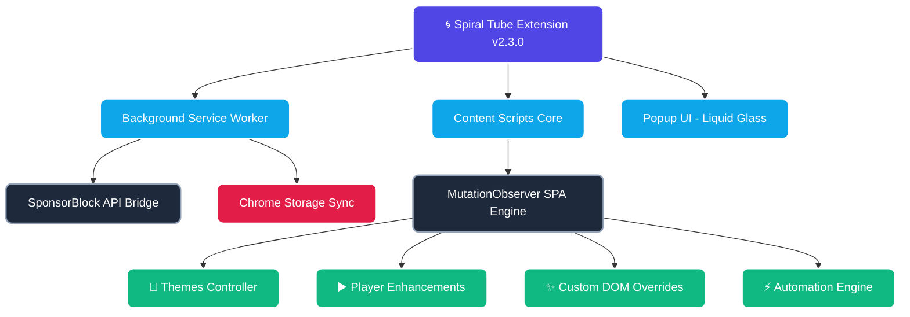
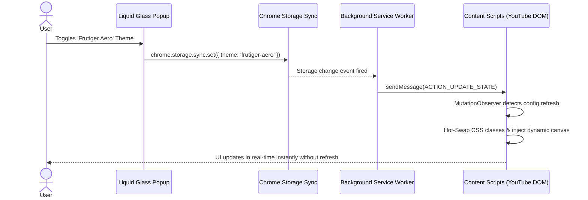
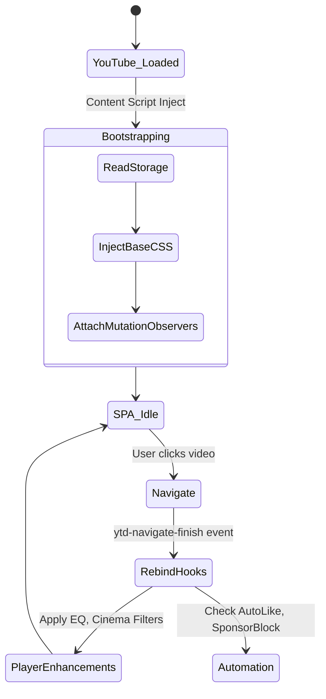

# Spiral Tube 🎬 (formerly YouTube Premium Plus)

> Transform YouTube with 50+ features: glassmorphism themes, 600% volume booster with custom EQ, cinema filters, SponsorBlock integration, focus & zen modes, custom speed controller, ambient mode, screenshot tool, subscription groups, watch history analytics, and a redesigned glassmorphic popup UI.

[](https://github.com/Osamu2500/youtube-premium-extension)
[]()
[]()
[](LICENSE)

---

## 📸 Visual Showcase

<div align="center">
  
  <p><i>The completely redesigned Liquid Glass settings panel.</i></p>
</div>

<details>
<summary><b>🖼️ View More Screenshots</b></summary>
<br>

| Theming Engine | Player Enhancements | Masonry Cursor Grid |
|:---:|:---:|:---:|
|  |  |  |

</details>

---

## 🏗️ Extension Architecture & Lifecycle

<details open>
<summary><b>🔍 1. Architecture Flowchart (Interactive)</b></summary>
<br>


</details>

<details>
<summary><b>🔄 2. Real-Time State Sync (Sequence Diagram)</b></summary>
<br>


</details>

<details>
<summary><b>🗺️ 3. User Execution Journey (State Map)</b></summary>
<br>


</details>

---

## 📈 The Ultimate Feature Matrix

### 🎨 Themes & UI Customization
| Component | Description | Performance Cost | Highlight Feature |
|:---|:---|:---:|:---|
| **8+ Immersive Themes** | High-fidelity glowing, aero, and OLED black themes. | `Medium` | *Liquid Glass, True Black* |
| **Typography Engine** | Overwrite fonts across the site, adjust dynamic scaling. | `Low` | *Inter / Monospace overrides* |
| **Layout Density** | Force Compact, Comfortable, or Spacious grid margins. | `Low` | *Spacious Grids* |

### ▶️ Player Overhaul
| Component | Description | Performance Cost | Highlight Feature |
|:---|:---|:---:|:---|
| **Pro Audio DSP** | Bypasses default limits with full EQ, compressor, balance. | `Medium` | *600% Volume Booster* |
| **Cinematic Visuals** | Hardware-accelerated CSS filters applied to video. | `High` | *Brightness/Contrast sliders* |
| **Global Player Bar** | Decoupled UI bar injected everywhere for immediate control. | `Low` | *Snapshot & Looping Tools* |

### ⚡ Automation & Analytics
| Component | Description | Performance Cost | Highlight Feature |
|:---|:---|:---:|:---|
| **AutoLike Service** | Silently likes videos of subscribed creators. | `Low` | *Configurable triggers* |
| **Multi-Select Matrix** | Overhauls standard lists into actionable macro queues. | `High` | *"Save to Playlist" macros* |
| **ChannelHealthUI** | Analytics dashboard overlay for advanced statistics. | `Medium` | *Watch-time tracking* |

### 🧭 Navigation & Integrations
| Component | Description | Performance Cost | Highlight Feature |
|:---|:---|:---:|:---|
| **Focus Modes** | Removes addictive hooks like Shorts and Recommended feeds. | `Medium` | *Zen Mode* |
| **Custom Overrides** | Replaces default headers/sidebars with glass variants. | `Low` | *Custom Masonry Cursors* |
| **SponsorBlock** | Skips baked-in sponsorships via community database API. | `Medium` | *Zero-click ad skipping* |

---

## ⚙️ Tech Stack & Performance Insights

Spiral Tube is engineered for maximum performance within YouTube's heavy Single Page Application (SPA).

- **Architecture Layer**: Built modularly utilizing ES Modules, completely dropping legacy spaghetti scripts.
- **SPA Routing**: YouTube dynamically updates without reloading. Spiral Tube heavily utilizes optimized `MutationObservers` coupled with strict debounce/throttle limits to ensure constant 60FPS UI rendering.
- **Audio Pipeline**: Leverages the Web Audio API context directly bridging to YouTube's `<video>` tag, ensuring zero-latency compression and volume boosting.
- **UI Framework**: Native Vanilla JS with a custom built `popup-schema.js` runtime rendering engine that hot-builds settings UI dynamically.

## 📦 Installation

> [!IMPORTANT]
> This extension **requires a build step** before it can be loaded. Source files in `src/` are bundled by Vite into `dist/`.

1. **Clone the repository**
   ```bash
   git clone https://github.com/Osamu2500/youtube-premium-extension.git
   cd youtube-premium-extension
   ```
2. **Install dependencies and build**
   ```bash
   npm install
   npm run build
   ```
3. **Load in Chrome**
   - Open `chrome://extensions/`
   - Enable **Developer mode**
   - Click **Load unpacked** and select the root directory.

## 🗺️ Roadmap
- [ ] Custom Video Player UI Skins
- [ ] WebGL based Audio Visualizers natively on the player
- [ ] Exportable/Shareable theme configurations
- [ ] More robust Analytics and History mapping

## 🤝 Contributing & License
Contributions are welcome! Please follow standard PR workflows and test heavily on YouTube due to frequent A/B testing variations.
This project is licensed under the **MIT License** - see the [LICENSE](LICENSE) file for details.
