# Spiral Tube 🎬 (formerly YouTube Premium Plus)

> Transform YouTube with 50+ features: glassmorphism themes, 600% volume booster with custom EQ, cinema filters, SponsorBlock integration, focus & zen modes, custom speed controller, ambient mode, screenshot tool, subscription groups, watch history analytics, and a redesigned glassmorphic popup UI.

[](https://github.com/Osamu2500/youtube-premium-extension)
[]()
[]()
[]()

---

## ✨ What's New? (Latest Features)

- 🫧 **Frutiger Aero Theme**: Nostalgic, bouncing bubbles background with fresh UI text styles.
- 🖱️ **Custom Cursors**: A new masonry grid UI to pick and choose your favorite cursors.
- 👍 **AutoLike Integration**: Automatically like videos to support creators without the extra clicks.
- ☑️ **Multi-Select & Queue Support**: Advanced multi-select UI with Save to Playlist automation.
- ⏱️ **Playlist Duration Calculator**: See exactly how much time a playlist will take to finish.
- 🎛️ **Cinematic Filters & Pro Equalizer**: Next-level audio-visual control housed within our new Liquid Glass interface.
- ⏭️ **SponsorBlock Integration**: Seamlessly skip sponsorships, intros, and other filler content automatically.
- 🪟 **Immersive Ambient Mode**: Extends Ambient lighting to cover the entire page behind the masthead.
- 📥 **SmartDownload**: A quick download button neatly integrated into the player UI.
- 📊 **ChannelHealthUI**: In-depth analytics for watch history and channel health.

## 📊 Extension Architecture

```mermaid
graph TD
    classDef primary fill:#4f46e5,stroke:#fff,stroke-width:2px,color:#fff,rx:8px,ry:8px
    classDef secondary fill:#0ea5e9,stroke:#fff,stroke-width:2px,color:#fff,rx:8px,ry:8px
    classDef accent fill:#e11d48,stroke:#fff,stroke-width:2px,color:#fff,rx:8px,ry:8px
    classDef dark fill:#1e293b,stroke:#94a3b8,stroke-width:2px,color:#fff,rx:8px,ry:8px
    classDef feature fill:#10b981,stroke:#fff,stroke-width:2px,color:#fff,rx:8px,ry:8px

    A[🌀 Spiral Tube Extension v2.3.0]:::primary --> B[Background Service Worker]:::secondary
    A --> C[Content Scripts Core]:::secondary
    A --> D[Popup UI - Liquid Glass]:::secondary
    
    %% Background Worker Sub-Modules
    B --> B1[SponsorBlock API Bridge]:::dark
    B --> B2[Alarms & Job Scheduler]:::dark
    B --> B3[Chrome Storage Sync]:::accent
    B --> B4[ChannelHealth Data Aggregator]:::dark

    %% Content Scripts Sub-Modules
    C --> G[MutationObserver SPA Engine]:::dark
    G --> I[🎨 UI & Themes Controller]:::feature
    G --> J[▶️ Player Enhancements]:::feature
    G --> K[✨ Custom DOM Overrides]:::feature
    G --> M[⚡ Automation Engine]:::feature
    
    %% UI & Theming Engine
    I --> I1(8+ Immersive Themes)
    I1 -.-> I1a(Liquid Glass / True Black / Ambient)
    I1 -.-> I1b(Vintage / Retro / Blue Sky)
    I1 -.-> I1c(Frutiger Aero / Nature)
    I --> I2(Typography & Layout Engine)
    I2 -.-> I2a(Custom Fonts / Dynamic Scaling)
    I2 -.-> I2b(Compact / Comfortable / Spacious Grids)
    
    %% Advanced Player Controls
    J --> J1(Pro Audio DSP)
    J1 -.-> J1a(Parametric EQ / Compressor)
    J1 -.-> J1b(600% Volume Booster)
    J --> J2(Visual Cinema Controls)
    J2 -.-> J2a(Brightness / Contrast / Saturation)
    J2 -.-> J2b(Hardware Auto-Quality 1080p+)
    J --> J3(Decoupled Global Player Bar)
    
    %% Custom DOM & Layout Injections
    K --> K1(Custom Cursor Engine)
    K1 -.-> K1a(Masonry Grid Selector)
    K --> K2(Playlist Calculator SPA)
    K --> K3(Immersive Ambient Extension)
    
    %% Automation & Productivity
    M --> M1(AutoLike Neural Trigger)
    M --> M2(Multi-Select Queue Matrix)
    M2 -.-> M2a(Save to Playlist Automation)
    M --> M3(SmartDownload API Wrapper)
    
    %% Popup UI Sub-Modules
    D --> L[⚙️ Settings Management]:::dark
    L --> E[(Sync to Storage)]:::accent
    D --> P1(Cinematic Filter Control Center)
    D --> P2(Pro Equalizer UI Panel)
    D --> P3(Modular Feature Toggles)
```

<details open>
<summary><b>🔍 Click to Expand Architecture Flowchart</b> (Interactive)</summary>
<br>


</details>

### 📈 The Ultimate Feature Matrix

<div align="center">
  
| 🧩 Core Module | ⚙️ Specific Sub-System | 📝 Deep-Dive Description | 🌟 Highlighted Capabilities |
|:---|:---|:---|:---|
| 🎨 **UI & Theming Engine** | **8+ Custom Themes** | A massive suite of high-fidelity themes. From glowing neon interfaces to nostalgic aero aesthetics and pure OLED blacks. | *Liquid Glass, True Black, Vintage, Blue Sky, Retro, Nature, Frutiger Aero* |
| | **Layout Density & Typography** | Completely overwrite YouTube's margins and fonts. Choose from system fonts, Inter, or monospace with dynamic scaling. | *Compact/Spacious grids, Custom Font injections* |
| ▶️ **Player Overhaul** | **Pro Audio DSP Engine** | Professional-grade audio processing bypassing default limits. Full parametric EQ, balance, and compressor logic. | *600% Volume Booster, Persistent Audio Profiles* |
| | **Cinematic Visual Filters** | Hardware-accelerated CSS filters applied directly to the video canvas for perfect visual balancing. | *Brightness, Contrast, Saturation sliders* |
| | **Global Player Bar** | A completely decoupled external player bar that travels with you across pages, giving instant control. | *Speed overrides, Snapshot captures, 1-Click Looping* |
| ⚡ **Automation & Productivity** | **AutoLike Service** | Intelligent background service that detects subscribed creators and automatically supports them. | *Configurable watch-time triggers, silent execution* |
| | **Multi-Select Matrix** | Overhauls standard lists into actionable queues. Select dozens of videos and process them instantly. | *"Save to Playlist" macros, advanced queueing* |
| | **SmartDownload Integration** | Connects to external download APIs and injects a seamless fetch button into the native YouTube player. | *1-Click HQ downloading directly from the player UI* |
| 🧮 **Analytics & Insights** | **ChannelHealthUI** | Intercepts standard metrics to build a comprehensive analytics dashboard right over the creator's page. | *Deep creator stats, watch-time tracking* |
| | **Playlist Calculator** | Scrapes DOM elements dynamically in the SPA to calculate the exact total duration of un-watched playlist videos. | *Real-time synchronized rendering, SPA compliant* |
| 🧭 **Navigation & Focus** | **Focus & Zen Modes** | Drastic layout changes intended for studying or theater-like viewing. Removes hooks and addictive UI traps. | *Hides Comments, Hides Shorts, Hides Recommended* |
| | **Custom Header Buttons** | Replaces default sidebars and menus with glassmorphic top-bar actions for ultra-fast navigation. | *Custom Masonry UI, Immersive overrides* |
| 🔗 **Core Integrations** | **SponsorBlock Bridge** | Connects to the community SponsorBlock API to automatically skip baked-in sponsorships and intros. | *Zero-click ad skipping, community-driven database* |

</div>

---

## 🚀 Feature Categories

### 🎨 Theme & UI
- **Premium Liquid Glass & Frutiger Aero Themes** - Deep translucent backgrounds layered with dynamic, animated radial color gradients or nostalgic bouncing bubbles.
- **True Black Mode** - OLED-friendly pure black backgrounds.
- **Redesigned Liquid Glass Popup** - Premium glowing interface with grid layout and spring animations.
- **Hide Scrollbar** - Clean, minimal interface.

### 🎛️ Customization Suite
- **Typography & Font Scaling** - Select from Inter, System Defaults, Monospace, and customize font sizes.
- **Dynamic Layout Density** - Adjust margins dynamically (Compact, Comfortable, Spacious grids).
- **Accents & Card Styles** - Change UI themes to flat, elevated, or glassmorphic, and replace Youtube's default red color.
- **Custom Cursors** - Personalize your pointer across all of YouTube.

### ▶️ Player Enhancements
- **Pro Equalizer & Volume Booster** - Boost audio up to 600% with persistent custom EQ, balance, and compressor settings.
- **Cinema Filters** - Brightness, contrast, and saturation controls.
- **Custom Speed Control** - Precise playback speed input.
- **Auto-Quality** - Force 1080p+ quality on all videos.
- **Remaining Time** - Show time left instead of elapsed time.
- **Snapshot & Loop Tools** - Take screenshots of the current frame and loop videos with one click.
- **Global Player Bar** - Decoupled external player bar for ultimate control.

### 🏠 Home Feed & Search Control
- **Hook-Free Home** - Completely hide the recommended feed.
- **Hide Watched** - Auto-hide videos you've already watched (>80% progress).
- **Grid Layouts** - Force 4x4 video grid display for home and search results.
- **Clean Search** - Hide "For You", Shorts, and "People also watched" suggestions.

### 🧭 Navigation & Distraction Control
- **Focus Modes** - Zen Mode, Study Mode (auto 1.25x speed), and Auto Cinema.
- **Custom Header Buttons** - Quick access to Trending, Shorts, Subscriptions, Watch Later.
- **Hide Comments & End Screens** - Total control over your viewing distractions.

---

## 📦 Installation

> [!IMPORTANT]
> This extension **requires a build step** before it can be loaded. The source files in `src/` are bundled by Vite into `dist/` — Chrome loads the built output, not the raw source.

1. **Clone the repository**
   ```bash
   git clone https://github.com/Osamu2500/youtube-premium-extension.git
   cd youtube-premium-extension
   ```

2. **Install dependencies and build**
   ```bash
   npm install
   npm run build
   ```

3. **Load in Chrome**
   - Open Chrome → `chrome://extensions/`
   - Enable **Developer mode**
   - Click **Load unpacked**
   - Select the **root** `youtube-premium-extension/` folder.

## 🏗️ Development Architecture

```
src/
├── background/         # Service worker
├── content/
│   ├── features/      # Individual feature modules (e.g. autolike.js, multiselect.js)
│   ├── themes/        # Frutiger Aero, Liquid Glass, Retro, Vintage
│   ├── ui-styles/     # Custom Cursors, Navigation, Overrides
│   ├── feature-manager.js  
│   └── styles.css         
├── popup/             # Extension popup UI (Liquid Glass)
└── assets/            # Icons and images
```

## 🤝 Contributing
Contributions are welcome! Please follow the standard fork, branch, commit, and PR workflow. Test thoroughly on YouTube since it acts as a dynamic SPA.

## 📝 License
This project is licensed under a Proprietary License - see the [LICENSE](LICENSE) file for details.

## ⚠️ Disclaimer
This extension is not affiliated with, endorsed by, or in any way officially connected with YouTube or Google LLC. It's a community project designed to enhance the user experience.
